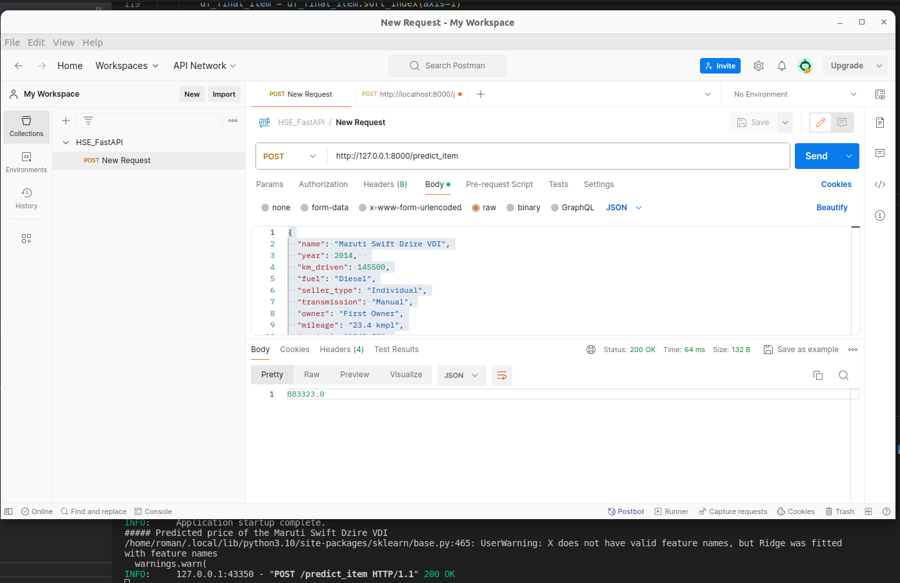
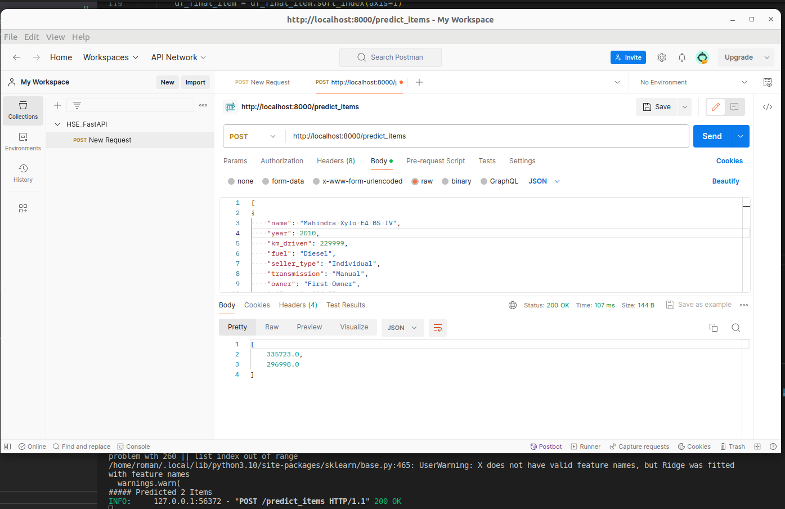

# Выводы по Домашней работе №1

## 1. Что сделано?
### В рамках ноутбука:
- провел EDA
- визуализировала
- стандартизировал
- обработа признак torque
- построил бизнесс-метрику
- по ходу задания построены разные модели (LinReg, Lasso, Ridge, ElasticNet) и подобрал параметры при помощи GridSearch
### В рамках самостоятельной работы над фичами:
- добавил новые признаки:
    - квадрат года
    - марку автомобиля
    - логарифим пробега
    - закодировал это все и добавил полиномы второй степени(¯\_(ツ)_/¯)
### Результаты:
- На вещественных признаках
    - LinearRegression  - R2 = 0.59875, MSE = 230647675547.2345
    - С L1 - R2 = 0.59487, MSE = 230648131970.83496
    - ElasticNet R2 = 0.59436, MSE = 233169271439.57858
- С категориальными признаками
    - LinearRegression - R2 = 0.61501, MSE = 221298291038.85986
- С кастомными признаками:
    - Ridge(с полиномами второй степени) - R2 = 0.45722, 222097239077.15738
    - Ridge (с новым признаком квадрат года выпуска) - R2 = 0.61362, MSE = 215664129995.82736
    - ElasticNet (с новым признаком квадрат года выпуска) - R2 = 0.62482, MSE =  215664129995.82736
    - Ridge (c всеми новыми признаками см "добавил признаки" + чистка от выбросов) - R2 = 0.81179, MSE = 8516275336.703616
    - Ridge (когда после добавления новых признаков добавил полиномы второй степени) - R2 = 0.73786, MSE = 11861894259.93917
### Что дало наибольший буст в качестве
> Чистка от выбросов + Новые признаки

> Забыть удалить целевую переменную из трейна

### Что сделать не вышло
> Потоньше поработать с выбросами


Модель лежит в репозитории в models
```
ridge_model_final.pkl
```


## 4. Доказательство работы сервиса



